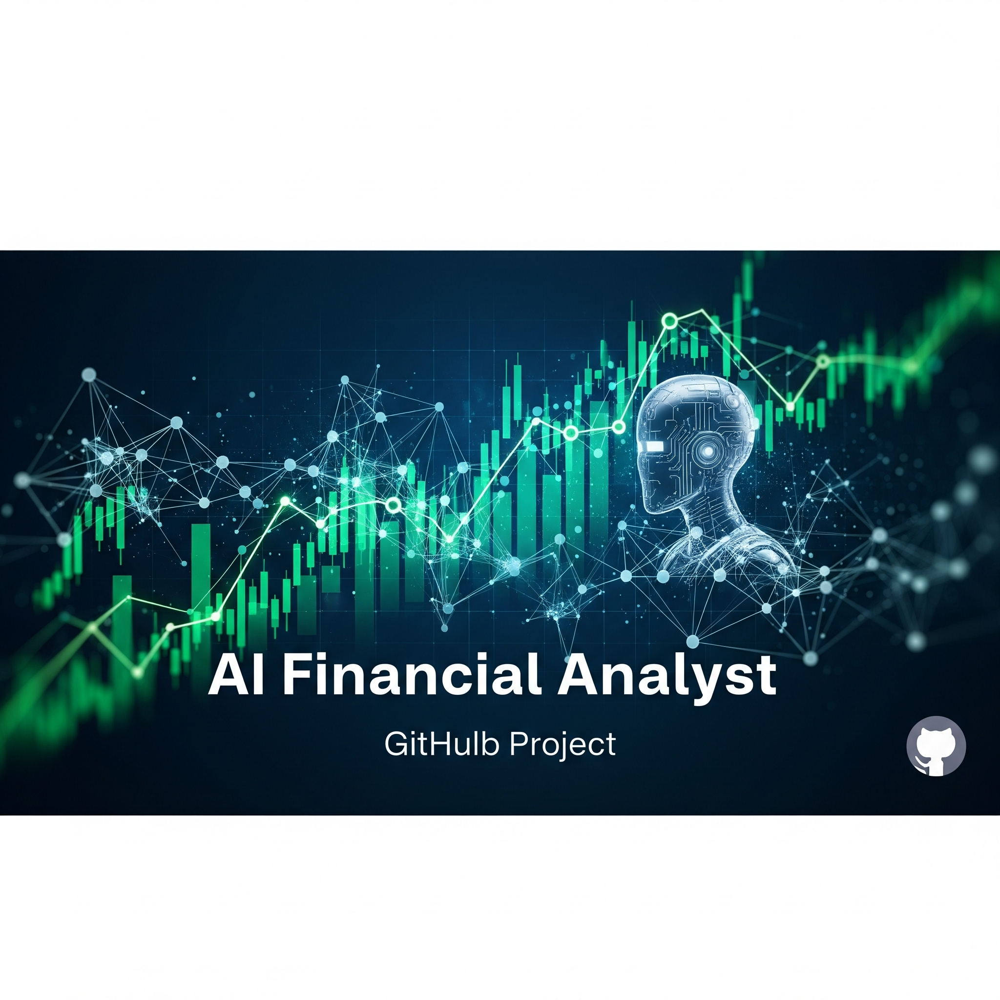

# Agentive AI for Financial Research & Analysis

<p align="center">
  
</p>

## Overview

This project features an autonomous AI agent designed to automate the complex workflow of a financial research analyst. Given a stock ticker (e.g., NVDA), the agent independently plans and executes a series of tasks to gather, process, and synthesize data from multiple sources. It culminates in a comprehensive, fact-grounded analysis report, reducing hours of manual research into minutes.

The core of this project is an **agentic loop** powered by a Large Language Model (LLM) that uses a suite of custom tools to interact with real-world data, demonstrating a practical application of modern, agentive AI systems.

## Key Features

- **Autonomous Task Planning:** The agent uses an LLM (Llama 3) and the LangChain Agents framework to break down a high-level goal (e.g., "Analyze this company") into a sequence of executable steps.
- **Multi-Tool Integration:** The agent is equipped with a versatile toolbox to gather diverse data:
    - **Financial Data API:** Pulls real-time quantitative data (stock prices, P/E ratios) from Alpha Vantage.
    - **Web Search:** Scans the web for recent news, market trends, and sentiment analysis.
    - **Document Parser:** Ingests and extracts key financial metrics from unstructured PDF documents like SEC 10-K filings.
- **Fact-Grounded Generation (RAG):** Implements a Retrieval-Augmented Generation (RAG) pipeline with a FAISS vector store. This ensures the final analysis is based on factual, retrieved data, significantly mitigating model hallucinations.
- **Automated Report Generation:** Produces a detailed, multi-section report summarizing quantitative metrics, qualitative sentiment, and key risk factors.

## Tech Stack

- **Core Framework:** Python, LangChain (Agents)
- **Large Language Model:** Llama 3
- **Knowledge & Retrieval:** RAG, Transformers, FAISS (Vector Store)
- **Data Tools:** Alpha Vantage API, PyMuPDF (PDF Parsing), Google Search API
- **API Wrapper (Optional):** FastAPI

## Project Workflow

1.  **User Prompt:** The user provides a stock ticker and a high-level analysis goal.
2.  **Agent Planning:** The LangChain agent, powered by Llama 3, determines a step-by-step plan (e.g., "First, get stock price. Second, search for recent news. Third, find the latest 10-K filing...").
3.  **Tool Execution:** The agent executes the plan by calling the appropriate tools in sequence.
4.  **Data Ingestion & Vectorization:** The data collected from all tools is chunked, embedded, and stored in a FAISS vector store.
5.  **RAG-Powered Synthesis:** The agent queries the vector store to retrieve relevant context and uses the LLM to write the final, fact-grounded analysis report.

## Setup & Usage

1.  **Clone the repository:**
    ```sh
    git clone [https://github.com/Your-Username/Financial-Analyst-Agent.git](https://github.com/Your-Username/Financial-Analyst-Agent.git)
    cd Financial-Analyst-Agent
    ```
2.  **Install dependencies:**
    ```sh
    pip install -r requirements.txt
    ```
3.  **Set up API keys:**
    Create a `.env` file and add your API keys for Alpha Vantage, Google Search, etc.
    ```
    ALPHA_VANTAGE_API_KEY="YOUR_KEY_HERE"
    ...
    ```
4.  **Run the agent:**
    ```sh
    python main.py --ticker "NVDA" --prompt "Analyze the financial health and market sentiment for NVIDIA."
    ```
