# Agentive Finance AI

Agentive Finance AI is an autonomous system for financial research and analysis that combines RAG (Retrieval-Augmented Generation), knowledge graph analytics, and live market data to provide fact-grounded insights about companies.

---



```mermaid
flowchart TD
    A["🧠 User Input: What is Tesla's stock price?"] --> B["🤖 Orchestrator Agent"]

    subgraph "📡 Data Retrieval"
        B --> C1["📄 SEC Filings Agent"]
        B --> C2["📈 Market Data Agent"]
        B --> C3["🔗 Knowledge Graph Agent"]
    end

    %% === SEC BRANCH ===
    C1 --> D1["📝 Extract People, Risks, Revenues"]
    D1 --> E1["📘 Filing Summary"]

    %% === MARKET DATA BRANCH ===
    C2 --> D2{"🔍 API Key Valid?"}
    D2 -->|Yes| E2["💵 Get Real-Time $TSLA Price"]
    D2 -->|No| E3["❗ Handle API Error"]

    %% === KNOWLEDGE GRAPH BRANCH ===
    C3 --> D3["🌐 Traverse Links (Tesla → IRS, etc.)"]
    D3 --> E4["📊 Return JSON"]

    %% === AGGREGATION & SYNTHESIS ===
    E1 --> F["🧩 Combine All Insights"]
    E2 --> F
    E3 --> F
    E4 --> F
    F --> G["🧠 RAG Engine (LLM Synthesis)"]
    G --> H["📺 Final Display: People, Price, Graphs, Summary"]
```

## 🚀 Features

- Ingest and index SEC filings (e.g. `10-K`, `10-Q`, `8-K`) using FAISS vector store  
- Perform real-time queries over filings + knowledge graph to extract key people, relationships, risks, and financial metrics  
- Fetch live stock prices using Alpha Vantage API  
- Use a knowledge graph (Neo4j) to map relationships among entities mentioned in filings  
- Generate comprehensive, structured analysis with sections for documents, graph insights, and market data  


## 📦 Tech Stack

| Component          | Technology Used                          |
|--------------------|-------------------------------------------|
| LLM / Embeddings   | OpenAI LLM + OpenAIEmbedding             |
| Vector Retrieval   | FAISS via `llama_index`                  |
| Knowledge Graph    | Neo4j, spaCy for NER                     |
| Market Data        | Alpha Vantage API                        |
| Other Tools        | Python, Pandas, dotenv, OS filesystem    |

---

## 🛠 Setup Instructions

1. Clone the repository:

   ```bash
   git clone https://github.com/Yeshwanth-git-tech/Agentive-Finance-AI.git
   cd Agentive-Finance-AI
   ```

2. Create a virtual environment and install dependencies:

   ```bash
   python -m venv env
   source env/bin/activate
   pip install -r requirements.txt
   ```

3. Create a `.env` file at the root with your API keys and credentials:

   ```ini
   OPENAI_API_KEY=your_openai_key
   ALPHA_VANTAGE_API_KEY=your_alpha_vantage_key
   NEO4J_USERNAME=your_neo4j_username
   NEO4J_PASSWORD=your_neo4j_password
   NEO4J_URI=bolt://localhost:7687  # or your Neo4j connection URI
   ```

4. Ensure your FAISS index has been ingested and the binaries + metadata are in `storage/faiss_index`.

5. Run the hybrid RAG + KG system:

   ```bash
   python -m scripts.kg.hybrid_rag_kg
   ```

---

## 🔍 Usage Examples

After the system starts up, you can run queries such as:

- `What is Tesla stock price?`  
- `Who are the key people mentioned in Apple’s latest 10-K?`  
- `Summarize Microsoft’s 10-Q and point out risk factors.`  

The output will include:

1. Document-based retrieval (from SEC filings)  
2. Entity relationships via knowledge graph  
3. Live market data for stocks mentioned  

---

## ⚠️ Troubleshooting

| Issue | Possible Fix |
|-------|--------------|
| FAISS index load error | Make sure `index.faiss` + metadata JSON files are present in `storage/faiss_index` |
| No market data | Check `ALPHA_VANTAGE_API_KEY` is set, request limit not exceeded, correct symbol mapping |
| Neo4j connectivity error | Ensure Neo4j service is running and credentials/URI in `.env` are correct |
| SpaCy NER too slow / long texts | Increase `nlp.max_length` and/or limit text passed to NER |

---

## 📂 Project Structure

```
Agentive-Finance-AI/
├── scripts/
│   ├── kg/
│   │   └── hybrid_rag_kg.py
│   ├── market_data.py
│   ├── ingest_filing.py
│   └── other utility modules...
├── storage/
│   └── faiss_index/
│       ├── index.faiss
│       ├── docstore.json
│       ├── index_store.json
│       └── ...
├── data/
│   └── stock_data/ (optional/historical)
├── .env
├── requirements.txt
└── README.md
```

---

## ⚙️ Contribution & Next Steps

- Add more company symbol mappings  
- Add fallback market data providers (e.g. Yahoo Finance)  
- Improve query parsing (e.g. detect company names automatically)  
- Add UI layer (Streamlit / Gradio)  
- Add tests for expected outputs  

---

## 📄 License

This project is licensed under the **MIT License**.

---

**Enjoy building!**  
Agentive Finance AI — cutting down research time so you can spend more on insights.